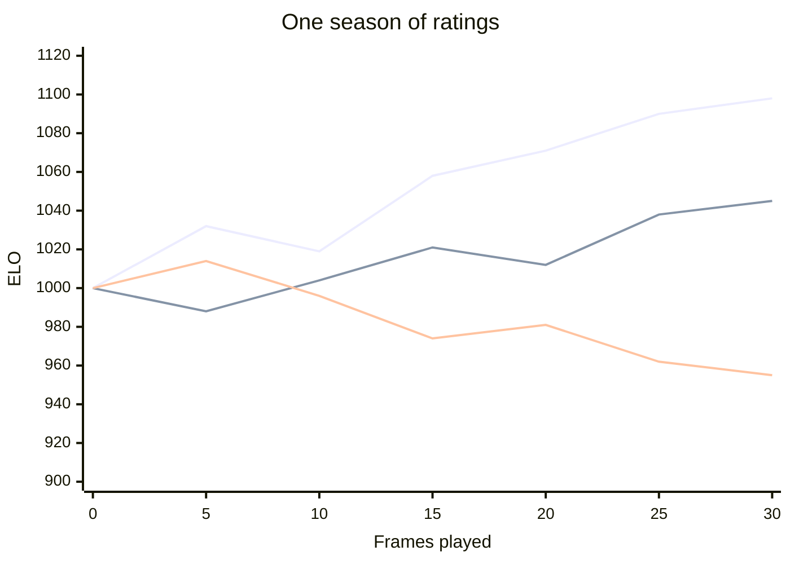
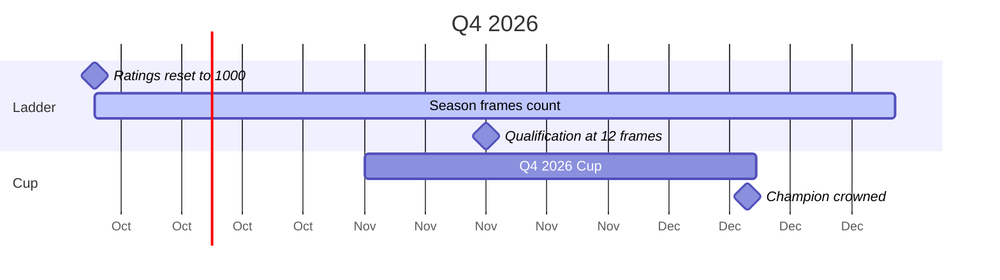
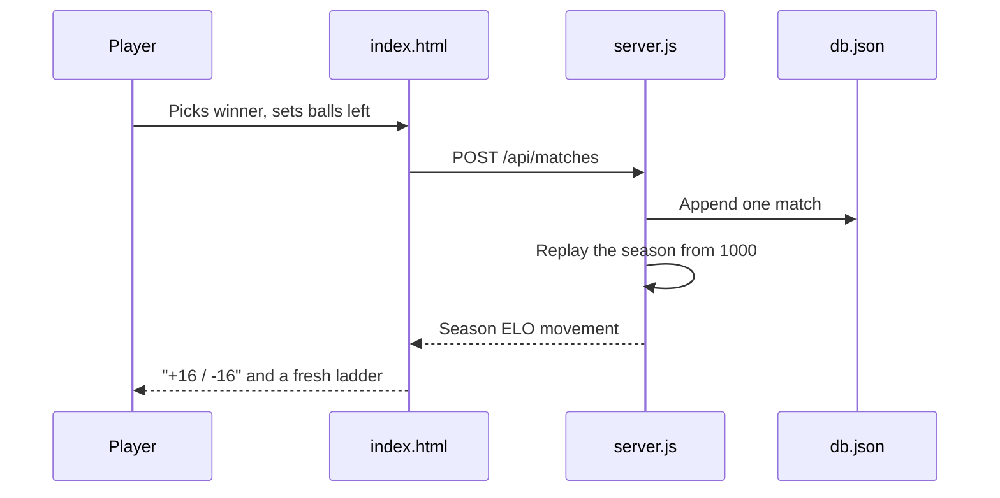
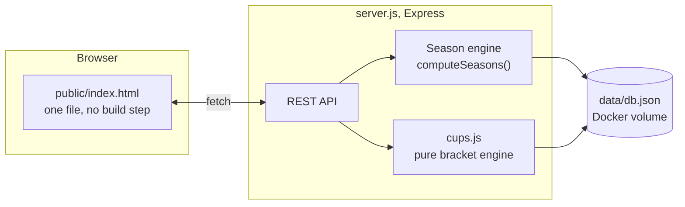
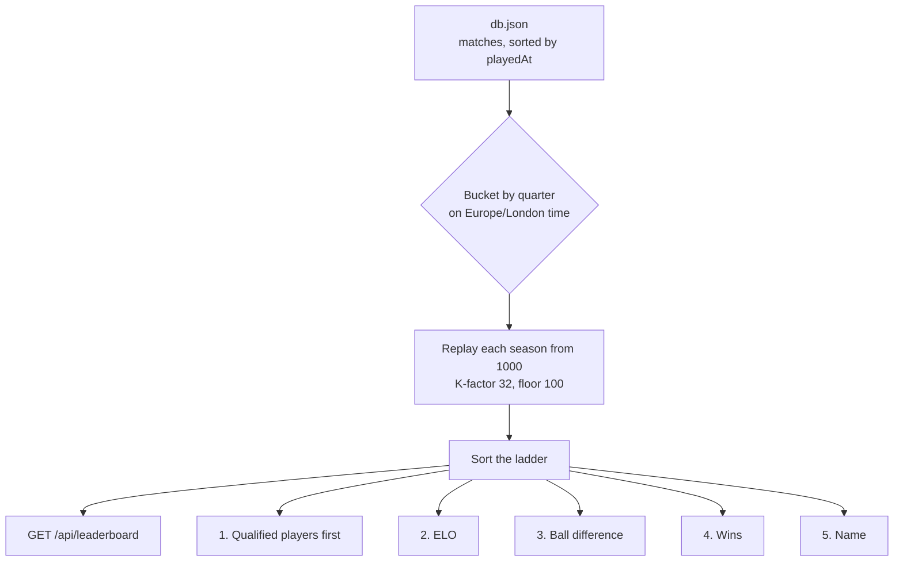
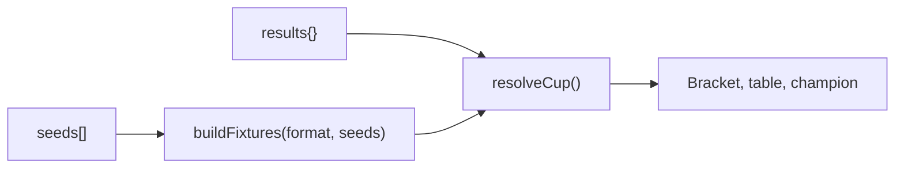
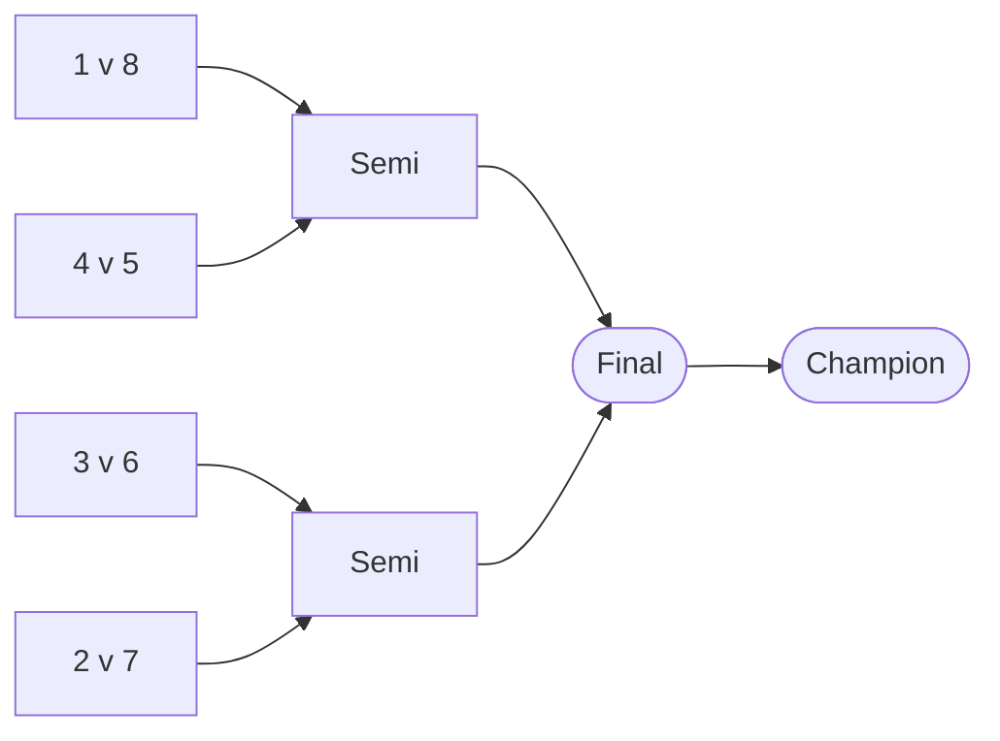
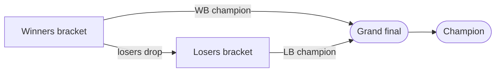

<h1 align="center">Carbonpool</h1>
<p align="center"><strong>Rack up, rank up.</strong></p>
<p align="center">The office 8-ball ladder. Quarterly ELO seasons, ball difference tie breaks, and a knockout cup every quarter.</p>

<p align="center">
  
  
  
  
</p>

---

## What it is

Two people play a frame. Someone records who won and how many balls the loser left on the table. Everything else is derived from that.

| You get | From |
|---|---|
| An ELO ladder | Replayed from match history, reset every quarter |
| A tie break with teeth | Ball difference, like goal difference in football |
| A reason to keep turning up | 12 frames a season or your rating sits below everyone ranked |
| Something to win | A cup each quarter, single elim, double elim or round robin |

## A season, in pictures

Every quarter everyone drops back to 1000 and starts again. Nobody coasts on a rating they earned in March.



The quarter is the whole competitive cycle. A cup runs alongside it and settles the argument the ladder cannot.



Recording a frame touches one file and nothing is written twice.



## Run it

```bash
npm install
npm start          # http://localhost:3000
```

Or with Docker, which is how it's deployed.

```bash
cp .env.example .env     # set PASSWORD and ADMIN_PASSWORD
docker compose up -d --build
```

Two passwords, two roles. `PASSWORD` lets anyone record a frame, add a player and run a cup. `ADMIN_PASSWORD` additionally allows deleting things.

---

## How it fits together



Three files carry the whole product.

| File | Owns |
|---|---|
| `server.js` | API, auth, ELO replay, seasons, qualification |
| `cups.js` | Bracket maths. Pure functions, no Express, no filesystem |
| `public/index.html` | Entire UI. Markup, styles and script inline |

`data/db.json` is the only state. It is gitignored and mounted as a Docker volume, so a rebuild never loses history.

---

## Nothing derived is stored

Ratings, ranks, forms and brackets are recomputed from the match list on every read.



So deleting a frame, or undoing a cup result, can't leave a stale rating or a half advanced bracket behind. No migrations, no cache to invalidate. Every read does the full replay, which costs nothing at this size.

### Ball difference

A frame stores only `ballsLeft`, the balls the loser still had on the table, 0 to 7. So a frame is worth `+ballsLeft` to the winner and `-ballsLeft` to the loser. A 7 is a table run and the biggest margin available. Old frames with no value recorded count as 0.

### Qualification

Play enough frames in a season or your rating doesn't hold a ranked place. You still show up, below everyone ranked, with a dash instead of a number.

```js
const QUALIFY_RULES = [
  { from: '0000-Q0', games: 10 },
  { from: '2026-Q4', games: 12 },
];
```

A rule applies from its season key onward and the last match wins, so raising the bar for a future quarter doesn't rewrite history.

---

## Cups

Pick the players, and they're seeded by current season ELO. Cup frames never touch ELO or the ladder, they live only inside the cup.

Fixtures aren't stored either. A cup row holds the seeds and the results, and the bracket is rebuilt from the format on every read.



### Single elimination

Seeds pad to the next power of two, so the top seeds take the byes.



### Double elimination

The winners bracket drops its losers into the losers bracket, which alternates between minor rounds taking the drop-ins and major rounds pairing survivors. Drop-ins arrive reversed so a player doesn't immediately meet whoever just knocked them down. One grand final, no bracket reset.



### Round robin

Circle method, everyone plays everyone once. Ranked by wins, then ball difference, then head to head, then name.

### Frame counts

| Format | Frames for N players | 8 players |
|---|---|---|
| Single elimination | `N - 1` | 7 |
| Double elimination | `2N - 2` | 14 |
| Round robin | `N(N-1)/2` | 28 |

### Undo

Deleting a cup result is blocked when a later frame depends on it. Undo the later frame first. The API says so and the UI shows it.

---

## API

Public routes are readable signed out. `auth` needs either password, `admin` needs the admin one.

| Route | Access | Does |
|---|---|---|
| `POST /api/login` | public | Exchanges a password for a session token |
| `GET /api/players` | public | Players with current season rating, falling back to their last rated season |
| `POST /api/players` | auth | Adds a player |
| `PUT /api/players/:id` · `DELETE` | admin | Renames or removes one |
| `GET /api/matches?season=` | public | Frames, newest first, with the season ELO movement |
| `POST /api/matches` | auth | Records a frame |
| `DELETE /api/matches/:id` | admin | Removes a frame and replays everything |
| `GET /api/seasons` | public | Every quarter that has frames, plus the current one |
| `GET /api/leaderboard?season=` | public | Ladder, last season's podium, qualification rule |
| `GET /api/cups` · `GET /api/cups/:id` | public | Cup list and resolved bracket |
| `POST /api/cups` | auth | Creates a cup |
| `POST /api/cups/:id/results` | auth | Records a cup frame |
| `DELETE /api/cups/:id/results/:fixtureId` | admin | Undoes one, if nothing depends on it |
| `DELETE /api/cups/:id` | admin | Deletes a cup |

Pass `?season=all` for the all-time view, or a key like `2026-Q3`.

---

## Changing things

One-line edits near the top of `server.js`, unless the row says otherwise.

| To change | Edit | Note |
|---|---|---|
| Rating reset between quarters | `SEASON_CARRYOVER` | `0` is a hard reset, `1` keeps ratings entirely, `0.5` pulls halfway back to 1000 |
| Starting rating | `START_ELO` | Also the rating a new player shows before their first frame |
| How fast ratings move | `calcEloChange`, K is 32 | Higher K means bigger swings per frame |
| Lowest possible rating | `FLOOR_ELO` | The displayed drop is clamped to match |
| Frames shown under Form | `FORM_LENGTH` | |
| Frames needed to qualify | `QUALIFY_RULES` | Add a row with the season key it starts from |
| When a quarter turns over | `SEASON_TZ` env var | Defaults to `Europe/London`, not UTC |
| Passwords | `.env` | `PASSWORD` and `ADMIN_PASSWORD` |

### Adding a cup format

1. Add the name to `FORMATS` in `cups.js`.
2. Teach `buildFixtures` to emit its fixture list. Each fixture is `{ id, bracket, round, index, a, b }`, where a slot is either `{ seed: n }` or `{ from: fixtureId, take: 'winner' | 'loser' }`. Feeders must come before the fixtures they feed.
3. `resolveCup` needs no change, it walks the list in order and advances byes itself.
4. Add the label to `FORMAT_LABELS` and a button to the format control in `public/index.html`.

### Adding a tie break

Add a comparator to the chain in `rankRows`. The order it sits in is the priority it gets.

```js
.sort((a, b) =>
  Number(b.qualified) - Number(a.qualified)
  || b.elo - a.elo
  || b.ballDiff - a.ballDiff
  || b.wins - a.wins
  || a.name.localeCompare(b.name))
```

Whatever the comparator reads has to be accumulated in the season replay loop first, the way `ballDiff` is.

### Adding a tab

No framework, no router. A tab is a `<button data-tab="x">` in the header, a `<section id="tab-x">` in `<main>`, and a loader called from the tab handler. Reuse the existing tokens rather than adding colours. Anything a signed-in user should see straight after login goes in `loadAll()`.

---

## House rules

- **No build step.** One HTML file, two runtime dependencies. A change that needs a bundler is the wrong change.
- **Derive, never store.** Anything recomputable from matches and cup results doesn't get written to the database.
- **Keep `cups.js` pure.** No Express, no filesystem, so the bracket maths can be tested on its own.
- **Tokens, not hex codes.** Colours, radii, shadows and easing are CSS custom properties on `:root`. Use them.
